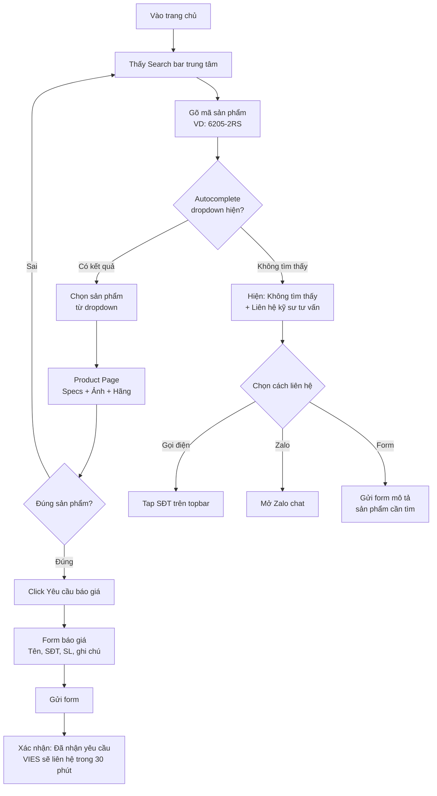
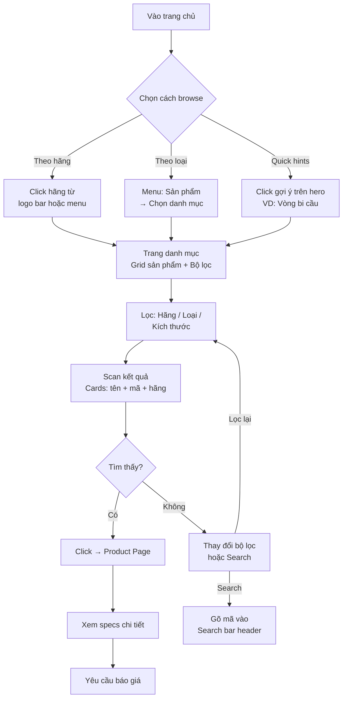
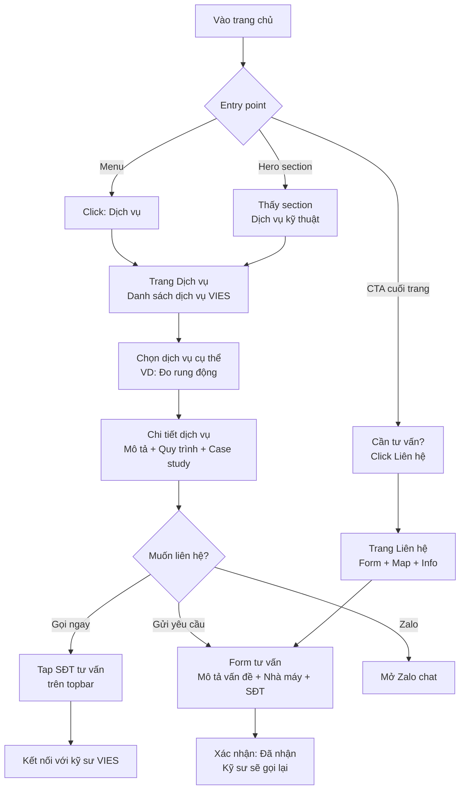

# UX Design Specification - VIES Web

**Author:** Tan
**Date:** 2026-02-04

---

## Business Context

- Công ty nhỏ, thành lập vài năm bởi nhóm kỹ sư tách ra từ SKF
- Bán đa hãng (SKF, FAG, NSK, Timken, NTN, KOYO...), sản phẩm đa dạng
- Core business: dịch vụ kỹ thuật, sản phẩm đi kèm (lấy từ đại lý/nhà phân phối về bán)
- Phục vụ mối quan hệ khách hàng cũ từ thời SKF + mở rộng thị trường
- Thế mạnh: chuyên môn kỹ thuật thật, hiểu sản phẩm sâu
- Yêu cầu: website tươm tất, KHÔNG bắt chước đại lý khác (Ngọc Anh, TST)

## Executive Summary

### Project Vision

VIES là công ty dịch vụ kỹ thuật công nghiệp, được thành lập bởi nhóm kỹ sư từng làm việc tại SKF. Core business là **dịch vụ kỹ thuật** (tư vấn, đo rung động, lắp đặt, bôi trơn), kèm theo cung cấp sản phẩm vòng bi và linh kiện công nghiệp đa hãng.

Website cần phản ánh đúng bản chất: đây là **đội ngũ kỹ sư đáng tin cậy**, không phải một cửa hàng online. Thiết kế cần tươm tất, chuyên nghiệp thực tế, không bắt chước các đại lý phân phối. Đồng thời vẫn có đầy đủ chức năng browse và tìm kiếm sản phẩm.

### Target Users

**Primary: Kỹ sư bảo trì nhà máy**
- Làm việc tại nhà máy sản xuất lớn (xi măng Hà Tiên, Đạm Phú Mỹ, nhà máy điện...)
- Cần tư vấn kỹ thuật chuyên sâu, chọn đúng sản phẩm cho ứng dụng cụ thể
- Quan tâm đến thông số kỹ thuật, giải pháp thực tế
- Liên hệ qua điện thoại, Zalo, email

**Secondary: Phòng mua hàng (Procurement)**
- Cần báo giá nhanh, chính xác
- So sánh sản phẩm, tìm mã tương đương
- Quan tâm đến năng lực nhà cung cấp, hồ sơ pháp lý

### Key Design Challenges

1. **Sai positioning hiện tại** - Website đang layout như đại lý bán hàng (product catalog first) trong khi core là dịch vụ kỹ thuật
2. **Không khác biệt** - Giao diện giống hệt Ngọc Anh, TST, Long Hải... cùng template xanh dương + grid sản phẩm
3. **Thiếu "con người"** - Thế mạnh lớn nhất của VIES là đội ngũ kỹ sư giỏi, nhưng website không thể hiện điều này
4. **Cân bằng services vs products** - Cần thể hiện cả hai: dịch vụ kỹ thuật dẫn đầu, sản phẩm đầy đủ chức năng browse/tìm kiếm

### Design Opportunities

1. **"Services-first" approach** - Lead with expertise & dịch vụ, products vẫn đầy đủ phía sau. Khác hoàn toàn với mọi đối thủ đang "products-first"
2. **Storytelling kỹ thuật** - Case studies từ nhà máy thật, giải pháp thật - thứ mà đại lý bán hàng không có
3. **Tone "anh em kỹ sư"** - Chuyên nghiệp nhưng gần gũi, thực tế, không corporate giả tạo
4. **Practical tools** - Bearing finder, quick quote, tài liệu kỹ thuật, browse/search sản phẩm - những thứ kỹ sư và phòng mua hàng thật sự cần

## Core User Experience

### Defining Experience

**Core action: "Tìm được sản phẩm hoặc liên hệ được người cần gặp - ngay lập tức."**

Khách hàng VIES không browse website để giải trí. Họ là kỹ sư, phòng mua hàng của nhà máy lớn - vào trang với mục đích rõ ràng:
- **60-70% Kịch bản B**: Cần tìm sản phẩm cụ thể (đã biết mã), xin báo giá → Search bar + danh mục sản phẩm
- **20-30% Kịch bản A**: Có vấn đề kỹ thuật cần tư vấn → Liên hệ nhanh đúng người
- **~10% Kịch bản C**: Tìm hiểu năng lực nhà cung cấp → Giới thiệu, dịch vụ

Khách cũ (chiếm phần lớn) đã trust sẵn, chủ yếu gọi điện. Website phục vụ thêm cho khách mới hoặc khi khách cũ cần tra mã sản phẩm nhanh.

### Platform Strategy

- **Web responsive** - desktop và mobile, không cần app riêng
- Desktop: kỹ sư tra cứu từ văn phòng nhà máy
- Mobile: kỹ sư tra nhanh khi đang ở hiện trường, gọi điện ngay
- 2 ngôn ngữ: Tiếng Việt (chính), English
- Không cần offline, không cần tính năng phức tạp

### Effortless Interactions

1. **Search sản phẩm**: Gõ mã vòng bi (VD: "6205", "22210 E") → ra kết quả ngay, không cần navigate qua nhiều trang
2. **Liên hệ nhanh**: Số điện thoại, Zalo luôn visible, 1 tap gọi được trên mobile
3. **Xin báo giá**: Từ trang sản phẩm → gửi yêu cầu báo giá trong 2 click, không cần đăng ký tài khoản
4. **Browse danh mục**: Lọc theo hãng, theo loại sản phẩm - đơn giản, không cần mega-menu phức tạp

### Critical Success Moments

1. **Make-or-break**: Khách gõ mã sản phẩm vào search → phải ra kết quả. Nếu search trống hoặc không hoạt động = mất khách
2. **Liên hệ**: Khách cần gọi/nhắn ngay → nếu phải cuộn tìm số điện thoại = mất khách
3. **First impression**: Vào trang chủ → trong 3 giây phải thấy "đây là chỗ tìm vòng bi + liên hệ kỹ sư" chứ không phải "đây là trang corporate giới thiệu công ty"

### Experience Principles

1. **"Thẳng vào việc"** - Không filler content, không slider chạy qua chạy lại. Mọi thứ phục vụ hành động cụ thể
2. **"Luôn tìm thấy đường liên hệ"** - Số điện thoại, Zalo sticky trên mọi trang, mọi thiết bị
3. **"Tìm = Thấy"** - Search phải hoạt động tốt, là feature số 1 của trang
4. **"Kỹ sư nói chuyện với kỹ sư"** - Tone chuyên nghiệp thực tế, không marketing rỗng. Thể hiện qua nội dung dịch vụ và cách trình bày sản phẩm

## Desired Emotional Response

### Primary Emotional Goals

| Cảm xúc | Mô tả | Ưu tiên |
|----------|-------|---------|
| **Tin cậy** | "Chỗ này đáng tin, không phải mấy trang bán hàng lung tung" | Cao nhất |
| **Hiệu quả** | "Nhanh gọn, tìm được ngay, không mất thời gian" | Cao nhất |
| **Đồng nghiệp** | "Mấy ông này hiểu nghề, cùng chuyên môn, không phải sales" | Cao |
| **An tâm** | "Yên tâm hàng chính hãng, không lo giả nhái" | Cao |

### Emotional Journey

- **Lần đầu vào trang**: "Ờ, trang này gọn gàng, tìm được thứ mình cần" → Tin cậy + Hiệu quả
- **Đang tìm sản phẩm**: "Gõ mã ra luôn, khỏi lòng vòng" → Hiệu quả
- **Xem dịch vụ**: "Mấy ông này làm thật, hiểu nghề" → Đồng nghiệp
- **Gửi yêu cầu báo giá**: "Đơn giản, nhanh" → Hiệu quả + An tâm
- **Quay lại lần sau**: "Trang quen rồi, vào tìm thôi" → Quen thuộc

### Cảm xúc cần TRÁNH

- **Rẻ tiền**: Trông giống mấy trang bán hàng Trung Quốc, quá nhiều banner, quá nhiều màu
- **Bực bội**: Tìm hoài không thấy, phải click nhiều bước
- **Amateur**: Trang cũ, lỗi, không responsive, font chữ lộn xộn
- **Giả tạo**: Dùng từ marketing rỗng kiểu "hàng đầu Việt Nam", "uy tín số 1"

### Design Implications

- **Tin cậy** → Layout sạch, typography rõ ràng, không clutter, không quá nhiều màu sắc
- **Hiệu quả** → Search bar nổi bật, navigation đơn giản, ít bước nhất có thể
- **Đồng nghiệp** → Ngôn ngữ thực tế (thông số kỹ thuật, tên gọi đúng ngành), không dùng superlative marketing
- **An tâm** → Hiển thị rõ thông tin công ty, hãng đối tác, hàng chính hãng - nhưng bằng cách tinh tế, không la hét

### Emotional Design Principles

1. **Ít hơn = Tin hơn** - Trang càng ít "la hét" (banner, popup, chữ to) thì càng đáng tin với kỹ sư
2. **Chuyên nghiệp = Thực tế** - Không phải corporate sang chảnh, mà là thể hiện đúng năng lực qua nội dung thật
3. **Tốc độ = Tôn trọng** - Website nhanh, tìm nhanh = tôn trọng thời gian người dùng

## UX Pattern Analysis & Inspiration

### Inspiring Products Analysis

**Nomo.com (Thụy Điển) - Content strategy**
- Phân chia rõ 2 nhóm khách: OEM (cần supply chain ổn định) vs MRO (cần tốc độ, linh hoạt)
- Tagline ngắn gọn: "Keeping industries in motion" - không la hét, không superlative
- Sản phẩm trình bày qua carousel 6 danh mục lớn - scannable, không dàn trải
- Tone: tự tin nhưng bình tĩnh, không cố gắng chứng minh gì cả

**Swedish/Scandinavian Web Design - Visual direction**
- Triết lý "Lagom" (vừa đủ): không quá nhiều, không quá ít
- Whitespace là yếu tố chính - tạo cảm giác tin cậy, chuyên nghiệp
- Color palette đơn giản: neutral tones, 1-2 accent color, không rực rỡ
- Typography: 1 font family, sans-serif, chơi với weight/size để tạo hierarchy
- Hình ảnh lớn, chất lượng cao, ít text
- Giảm cognitive load: ít lựa chọn = ít mệt mỏi khi dùng

### Transferable UX Patterns

**Từ Nomo → VIES:**
- Phân chia content theo nhóm khách: "Dịch vụ kỹ thuật" vs "Sản phẩm & Báo giá"
- Tagline ngắn, thể hiện bản chất thay vì superlative marketing
- Carousel danh mục sản phẩm đơn giản, visual-first

**Từ Swedish Design → VIES:**
- Whitespace nhiều, layout thoáng - khác biệt hoàn toàn với đối thủ VN (chật, nhiều banner)
- Palette: nền trắng/xám nhạt + 1 accent color mạnh
- Sans-serif font duy nhất, rõ ràng
- Hình ảnh sản phẩm lớn, clean background

### Anti-Patterns to Avoid

1. **"Trang đại lý Việt Nam"** - Banner xanh dương chạy slider, grid sản phẩm dày đặc, popup chat, quá nhiều text (Ngọc Anh, TST)
2. **"Corporate quá mức"** - Hero video hoành tráng, mission statement dài, stock photo người bắt tay (Schaeffler, Timken)
3. **"E-commerce thuần"** - Giỏ hàng, giá, mua ngay, đánh giá sao - không phù hợp B2B industrial
4. **"Trung Quốc style"** - Quá nhiều màu, quá nhiều banner khuyến mãi, font lộn xộn

### Design Inspiration Strategy

**Adopt (Lấy nguyên):**
- Swedish minimalism: whitespace, clean typography, muted palette
- Nomo content approach: phân nhóm khách, ngôn ngữ thực tế

**Adapt (Điều chỉnh):**
- Nomo là nhà phân phối lớn (80 năm) → VIES nhỏ hơn, cần tone gần gũi hơn, "anh em kỹ sư" thay vì "corporation"
- Swedish design thường cool/lạnh → thêm chút warmth cho thị trường VN/Cambodia

**Avoid (Tránh):**
- Copy layout đại lý VN (Ngọc Anh, TST, Long Hải)
- Corporate style quá nặng nề
- E-commerce B2C mindset

## Design System Foundation

### Design System Choice

**Tailwind CSS 4.1 thuần** - không thêm UI component library (DaisyUI, Chakra, MUI...)

### Rationale for Selection

1. **Đã có sẵn** trong project, zero migration cost
2. **Toàn quyền kiểm soát visual** - cần thiết để implement Swedish minimalism mà không bị ràng buộc bởi style DNA của library khác
3. **Nhẹ, nhanh** - không thêm JS runtime, phù hợp nguyên tắc "Tốc độ = Tôn trọng"
4. **Team nhỏ** - Tailwind utilities đủ đơn giản, không cần học thêm abstraction layer
5. **Component VIES đơn giản** - search bar, product cards, navigation, forms → không cần library phức tạp

### Implementation Approach

- Dùng Tailwind utility classes trực tiếp
- Tạo custom design tokens trong `tailwind.config.ts` (colors, spacing, typography)
- Xây dựng React components tái sử dụng cho patterns lặp lại (ProductCard, SearchBar, ContactWidget...)
- Không dùng `@apply` quá nhiều - ưu tiên utility-first

### Customization Strategy

Design tokens cần định nghĩa cho Swedish minimalism:
- **Colors**: Neutral palette (white, gray scale) + 1 accent color mạnh + 1 secondary subtle
- **Typography**: 1 sans-serif font family, scale rõ ràng (heading/body/caption)
- **Spacing**: Generous whitespace, consistent padding/margin scale
- **Border radius**: Minimal (0-4px), không rounded quá mức
- **Shadows**: Subtle hoặc không có, dùng border nhẹ thay thế
- **Transitions**: Nhẹ nhàng, không flashy

## Defining Core Experience

### Defining Experience

**"Xác nhận VIES có hàng → liên hệ lấy giá - trong 30 giây"**

Khách hàng VIES không "mua sắm". Họ đã biết chính xác cần gì trước khi vào trang. Website đóng vai trò:
1. Xác nhận VIES có sản phẩm/dịch vụ họ cần
2. Cung cấp kênh liên hệ nhanh nhất để chốt giá

### User Mental Model

Kỹ sư/phòng mua hàng tìm sản phẩm theo 3 cách:
- **Biết mã chính xác**: "6205-2RS", "22210 E" → gõ search, ra ngay
- **Biết loại + kích thước**: "vòng bi cầu, đường kính trong 25mm" → browse danh mục, lọc
- **Mô tả vấn đề**: "cần thay vòng bi cho motor 15kW" → liên hệ tư vấn trực tiếp

Giá không công khai vì phụ thuộc thời điểm, dự án, số lượng → website KHÔNG hiển thị giá, chỉ có nút "Yêu cầu báo giá". Thông số kỹ thuật thì public, cùng specs là dùng được → hiển thị specs rõ ràng trên product page.

### Success Criteria

| Tiêu chí | Mô tả |
|----------|-------|
| **Tìm thấy** | Gõ mã → ra kết quả trong < 1 giây |
| **Xác nhận** | Thấy đúng sản phẩm + specs cơ bản → "đúng cái này" |
| **Liên hệ** | Từ product page → gọi/Zalo/form báo giá trong 1 click |
| **Không tìm thấy** | Nếu search không ra → hiện ngay "Liên hệ kỹ sư tư vấn" thay vì trang trống |

### Experience Mechanics

**Flow 1: Search by SKU (phổ biến nhất)**
1. **Initiation**: Search bar nổi bật trên header, placeholder "Nhập mã sản phẩm: 6205, 22210..."
2. **Interaction**: Gõ → autocomplete/instant results dropdown
3. **Feedback**: Hiện kết quả ngay (tên + hãng + ảnh nhỏ), hoặc "Không tìm thấy - liên hệ tư vấn"
4. **Completion**: Click vào → product page với specs + nút "Yêu cầu báo giá" + số điện thoại

**Flow 2: Browse by category/brand**
1. **Initiation**: Menu: Sản phẩm → theo hãng hoặc theo loại
2. **Interaction**: Lọc đơn giản (hãng, loại, kích thước)
3. **Feedback**: Grid sản phẩm gọn, mỗi card hiện tên + mã + hãng
4. **Completion**: Click → product page → báo giá

**Flow 3: Cần tư vấn kỹ thuật**
1. **Initiation**: Số điện thoại/Zalo luôn visible, hoặc vào trang "Dịch vụ"
2. **Interaction**: Gọi điện hoặc gửi form mô tả vấn đề
3. **Feedback**: Xác nhận đã nhận yêu cầu
4. **Completion**: VIES liên hệ lại

### Novel UX Patterns

Không cần innovation - dùng **established patterns** quen thuộc:
- Search bar kiểu Google (gõ → ra ngay)
- Product cards kiểu catalog
- Sticky contact bar (phone + Zalo), không popup chat phức tạp
- Form báo giá đơn giản (tên, SĐT, sản phẩm cần, số lượng)

Điểm khác biệt không nằm ở pattern mà ở **execution**: clean, nhanh, không rườm rà

## Visual Design Foundation

### Color System

**Palette: "Nordic Industrial"** - Scandinavian minimalism + warmth cho thị trường VN

| Token | Hex | Mục đích |
|-------|-----|----------|
| `--bg` | `#FAFAFA` | Background chính - trắng ấm |
| `--bg-alt` | `#F0F0F0` | Background sections xen kẽ |
| `--text` | `#1A1A2E` | Text chính - dark navy |
| `--text-muted` | `#6B7280` | Text phụ, labels |
| `--primary` | `#0F4C75` | Accent chính - steel blue |
| `--primary-light` | `#E8F0F7` | Background highlight nhẹ |
| `--accent` | `#D4A843` | Accent phụ - amber/gold ấm, CTA quan trọng |
| `--border` | `#E5E7EB` | Border nhẹ thay shadow |
| `--success` | `#059669` | Trạng thái thành công |
| `--error` | `#DC2626` | Trạng thái lỗi |

Steel blue (#0F4C75) khác hẳn xanh dương generic (#0066CC) của Ngọc Anh/TST. Amber accent tạo warmth, tránh lạnh lẽo Scandinavian thuần.

### Typography System

**Font: Inter** (alternative: IBM Plex Sans)
- Sans-serif, hiện đại, hỗ trợ tốt tiếng Việt có dấu, free, web-optimized

| Level | Size | Weight | Dùng cho |
|-------|------|--------|----------|
| H1 | 36px / 2.25rem | 700 | Page title |
| H2 | 28px / 1.75rem | 600 | Section title |
| H3 | 20px / 1.25rem | 600 | Subsection, card title |
| Body | 16px / 1rem | 400 | Nội dung chính |
| Small | 14px / 0.875rem | 400 | Labels, captions |
| Caption | 12px / 0.75rem | 500 | Badges, tags |

Line height: 1.6 (body), 1.3 (headings)

### Spacing & Layout Foundation

**Base unit: 8px** - mọi spacing là bội số của 8

| Token | Value | Dùng cho |
|-------|-------|----------|
| `xs` | 4px | Gaps nhỏ trong cùng element |
| `sm` | 8px | Padding buttons, badges |
| `md` | 16px | Padding cards, gaps items |
| `lg` | 24px | Margin giữa sections nhỏ |
| `xl` | 32px | Margin elements lớn |
| `2xl` | 48px | Padding section |
| `3xl` | 64px | Section spacing desktop |
| `4xl` | 96px | Hero padding, major sections |

- Max-width container: 1280px
- Grid: 12 columns, gap 24px
- Whitespace giữa sections: 64-96px
- Cards: border 1px --border, no shadow, border-radius 4px

### Accessibility Considerations

- Contrast ratio tối thiểu 4.5:1 (WCAG AA)
- --text trên --bg = ~15:1, --primary trên white = ~7:1 → pass
- Focus states rõ ràng cho keyboard navigation
- Font size tối thiểu 14px, body 16px
- Touch targets tối thiểu 44x44px trên mobile

## Design Direction

### Chosen Direction

**Direction A: Search-First** + Top bar từ Direction B

Mockup HTML: `_bmad-output/planning-artifacts/ux-design-directions.html`

### Layout Structure (Homepage)

1. **Top bar** (steel blue): SĐT báo giá + SĐT tư vấn + email | Language switcher (VI/EN)
2. **Header** (trắng): Logo VIES + Navigation (Dịch vụ, Sản phẩm, Tin tức, Về chúng tôi) + Nút "Liên hệ" (amber)
3. **Hero** (nền sáng): Search bar lớn trung tâm + subtitle + quick search hints (6205-2RS, 22210 E...)
4. **Dual Section**: Dịch vụ kỹ thuật (nền steel blue, text trắng) | Sản phẩm (nền trắng, grid 2x2 danh mục)
5. **Thương hiệu đối tác**: Logo row (SKF, FAG, NSK, TIMKEN, NTN, KOYO)
6. **CTA**: "Cần tư vấn hoặc báo giá?" + nút gọi + nút Zalo
7. **Footer**: Thông tin công ty

### Rationale

- Search-first phù hợp mental model khách hàng (biết mã sản phẩm, vào tìm nhanh)
- Top bar giữ SĐT visible mọi lúc → giảm friction liên hệ
- Dual section dịch vụ/sản phẩm thể hiện rõ VIES là công ty dịch vụ kỹ thuật, không phải dealer thuần
- Tối giản, thẳng vào việc → đúng triết lý "Lagom" Scandinavian

### Color Strategy

- **Website palette**: Steel blue (#0F4C75) + Amber (#D4A843) - "Nordic Industrial"
- **Logo**: Tím + Xanh lá (brand identity) - hiển thị nguyên bản trên header/footer
- Logo và website palette độc lập nhau, không ép website theo màu logo

## User Journey Flows

### Journey 1: Search by SKU (Tìm sản phẩm bằng mã)

**Tần suất**: 60-70% traffic | **User**: Kỹ sư bảo trì, Phòng mua hàng

Đây là flow phổ biến nhất. Khách đã biết mã sản phẩm, vào trang chỉ để xác nhận VIES có hàng và xin báo giá.

**Key Design Points:**
- Search bar là element đầu tiên user nhìn thấy trên hero
- Autocomplete hiện kết quả real-time khi gõ (debounce 300ms)
- Kết quả dropdown hiện: ảnh nhỏ + tên + mã + hãng
- Khi không tìm thấy: KHÔNG hiện trang trống, mà gợi ý liên hệ ngay
- Product page: specs kỹ thuật rõ ràng, nút báo giá nổi bật (amber)

### Journey 2: Browse & Discover (Tìm theo danh mục)

**Tần suất**: 20-25% traffic | **User**: Phòng mua hàng, Kỹ sư chưa biết chính xác mã

Khách biết loại sản phẩm hoặc hãng cần, nhưng chưa có mã cụ thể. Cần browse và lọc.

**Key Design Points:**
- Navigation menu đơn giản: Sản phẩm → theo Hãng hoặc theo Loại
- Logo bar thương hiệu trên homepage là entry point nhanh để browse theo hãng
- Bộ lọc sidebar đơn giản (không mega-filter phức tạp)
- Product cards: ảnh + tên + mã + hãng, không hiện giá
- Khi lọc không ra: gợi ý search hoặc liên hệ

### Journey 3: Technical Services (Tư vấn kỹ thuật)

**Tần suất**: 10-15% traffic | **User**: Kỹ sư bảo trì cần giải pháp

Khách có vấn đề kỹ thuật cụ thể, cần tư vấn từ đội ngũ kỹ sư VIES. Đây là core business thật sự.

**Key Design Points:**
- Trang Dịch vụ: tone "kỹ sư nói chuyện với kỹ sư", không marketing rỗng
- Mỗi dịch vụ có case study thực tế (nhà máy thật, kết quả thật)
- SĐT tư vấn luôn visible trên topbar mọi trang
- Form tư vấn: mô tả vấn đề + nhà máy/thiết bị + thông tin liên lạc
- Dual section trên homepage (nền steel blue) là entry point chính

### Journey Patterns

**Navigation Patterns:**
- **Persistent Contact**: SĐT + email luôn trên topbar, mọi trang, mọi thiết bị
- **Search-First**: Search bar nổi bật trên hero và header, là primary action
- **Flat Navigation**: Menu đơn giản 4-5 items, không mega-menu

**Decision Patterns:**
- **Binary Choice**: Mỗi trang đưa ra 1-2 lựa chọn rõ ràng (báo giá hoặc liên hệ)
- **Graceful Fallback**: Khi không tìm thấy → gợi ý liên hệ kỹ sư, không bao giờ trang trống

**Feedback Patterns:**
- **Instant Response**: Autocomplete search, loading states rõ ràng
- **Confirmation**: Sau gửi form → xác nhận + thời gian phản hồi dự kiến
- **Empty State**: Không bao giờ "0 kết quả" mà luôn có hướng dẫn tiếp theo

### Flow Optimization Principles

1. **Minimal Steps to Value**: Từ homepage → báo giá chỉ cần 3 bước (search → product → form)
2. **Always Offer Contact**: Mọi dead-end đều có đường liên hệ (SĐT, Zalo, form)
3. **Mobile-First Contact**: Trên mobile, SĐT tap-to-call, Zalo tap-to-chat
4. **No Registration Required**: Báo giá và liên hệ không cần tạo tài khoản
5. **Progressive Disclosure**: Homepage hiện tổng quan, click vào mới hiện chi tiết

## Component Strategy

### Design System Components

**Tailwind CSS 4.1** cung cấp utility classes, không có pre-built components. Tất cả components build bằng React + Tailwind utilities, sử dụng design tokens đã định nghĩa (colors, spacing, typography).

### Custom Components

| Component | Purpose | Dùng ở |
|-----------|---------|--------|
| **SearchBar** | Tìm sản phẩm bằng mã/tên, autocomplete dropdown | Hero (lớn) + Header (compact) |
| **ProductCard** | Hiển thị sản phẩm trong grid/list | Trang sản phẩm, search results |
| **QuoteRequestForm** | Gửi yêu cầu báo giá | Product page, trang liên hệ |
| **ContactBar** | SĐT + email luôn visible | Topbar mọi trang |
| **ServiceCard** | Hiển thị dịch vụ kỹ thuật | Homepage (compact) + Trang dịch vụ |
| **NavigationHeader** | Navigation chính + logo + CTA | Mọi trang |
| **BrandLogoBar** | Logo thương hiệu đối tác | Homepage, footer |
| **EmptyState** | Khi search/filter không có kết quả | Search, danh mục |
| **CategoryFilter** | Lọc sản phẩm theo hãng/loại | Trang danh mục |
| **CTASection** | Call-to-action liên hệ/báo giá | Homepage, cuối mỗi trang |

### Component Specifications

**SearchBar**
- States: empty, typing, loading, results, no-results
- Variants: Hero (lớn, centered) + Header (compact, inline)
- Autocomplete: debounce 300ms, dropdown hiện ảnh + tên + mã + hãng
- No-results: gợi ý liên hệ kỹ sư, không trang trống
- A11y: `role="combobox"`, `aria-expanded`, keyboard nav (Arrow, Enter, Escape)

**ProductCard**
- Content: ảnh + tên + mã SKU + hãng + nút báo giá
- Variants: Grid (vertical) + List (horizontal)
- Hover: subtle border change
- A11y: semantic `<article>`, alt text

**QuoteRequestForm**
- Fields: tên, SĐT, email, sản phẩm (pre-filled nếu từ product page), số lượng, ghi chú
- States: empty → filling → validating → submitting → success/error
- Success: xác nhận + "VIES sẽ liên hệ trong 30 phút"
- A11y: labels, inline errors, focus management

**ContactBar**
- Desktop: topbar full-width (steel blue), SĐT + email bên trái, language switcher bên phải
- Mobile: compact, `tel:` links tap-to-call
- Content: ☎ Báo giá: 0903 326 309 · ☎ Tư vấn: 0908 748 304 · info@v-ies.com | VI / EN

**NavigationHeader**
- Desktop: Logo + Menu (Dịch vụ, Sản phẩm, Tin tức, Về chúng tôi) + SearchBar compact + CTA "Liên hệ" (amber)
- Mobile: Logo + hamburger menu + search icon
- Scrolled: sticky, compact height
- A11y: `<nav>` landmark, mobile menu toggle

**CategoryFilter**
- Desktop: sidebar với filter groups (hãng, loại, kích thước)
- Mobile: bottom sheet hoặc collapsible
- Active filters: hiện chips, clear all button

**EmptyState**
- Message + icon + gợi ý: "Liên hệ kỹ sư tư vấn" với SĐT + Zalo
- A11y: `role="status"`

### Component Implementation Strategy

- Build tất cả components cùng lúc, không chia phase
- Dùng Tailwind utility classes trực tiếp, hạn chế `@apply`
- Design tokens trong `tailwind.config.ts`: colors, spacing, font theo Visual Foundation
- Mỗi component là React Server Component khi có thể, Client Component chỉ khi cần interactivity (SearchBar, CategoryFilter, NavigationHeader mobile menu)
- Responsive: mobile-first approach, breakpoints sm/md/lg/xl
- Accessibility: WCAG AA, keyboard navigation, screen reader support

## UX Consistency Patterns

### Button Hierarchy

| Level | Style | Dùng cho | Ví dụ |
|-------|-------|----------|-------|
| **Primary** | Amber (#D4A843), text dark, bold | CTA chính, 1 per section | "Yêu cầu báo giá", "Liên hệ" |
| **Secondary** | Steel blue (#0F4C75), text trắng | Action phụ quan trọng | "Xem chi tiết", "Gọi ngay" |
| **Tertiary** | Outline border, text steel blue | Action phụ | "Xem thêm", "Lọc" |
| **Ghost** | Text only, underline on hover | Links, navigation | "Quay lại", "Xem tất cả" |

- Mỗi section/card chỉ có tối đa 1 Primary button
- Mobile: buttons full-width, min height 48px
- Disabled state: opacity 0.5, cursor not-allowed

### Feedback Patterns

**Success** (green #059669)
- Form submission: Toast notification top-right, tự ẩn sau 5s
- Nội dung: "Đã gửi yêu cầu thành công. VIES sẽ liên hệ trong 30 phút."

**Error** (red #DC2626)
- Form validation: Inline error dưới field, border đỏ
- API error: Toast notification, không tự ẩn, có nút "Thử lại"
- Nội dung: mô tả cụ thể lỗi gì, không dùng "Có lỗi xảy ra"

**Loading**
- Search: Skeleton placeholder trong dropdown
- Page: Simple spinner centered
- Form submit: Button disabled + spinner icon thay text

**Empty State**
- Luôn có: icon minh họa + message + CTA liên hệ
- Search: "Không tìm thấy sản phẩm. Liên hệ kỹ sư tư vấn: 0908 748 304"
- Filter: "Không có sản phẩm phù hợp. Thử thay đổi bộ lọc hoặc tìm kiếm."

### Form Patterns

**Layout:**
- Labels phía trên field (không inline)
- Required fields: dấu * đỏ sau label
- Help text: text muted dưới field
- Error: text đỏ dưới field, thay help text

**Validation:**
- Real-time cho SĐT, email (khi blur)
- Submit-time cho required fields
- Focus vào field lỗi đầu tiên sau submit fail

**Quote Request Form (core form):**
- Tên (required) → SĐT (required) → Email → Sản phẩm (pre-filled nếu từ product page) → Số lượng → Ghi chú
- Submit button: Primary "Gửi yêu cầu báo giá"
- Không CAPTCHA, không đăng ký tài khoản

### Navigation Patterns

**Desktop:**
- Topbar: steel blue, fixed top, SĐT + email | VI/EN
- Header: white, sticky below topbar khi scroll, Logo + Menu + Search compact + CTA
- Menu items: text, hover underline, active bold
- Dropdown: đơn giản, 1 cấp (Sản phẩm → Theo hãng / Theo loại)

**Mobile:**
- Topbar: ẩn khi scroll down, hiện khi scroll up
- Header: sticky, Logo + hamburger + search icon
- Menu: full-screen slide from right, overlay
- Bottom: sticky CTA bar (Gọi + Zalo) trên product pages

**Breadcrumb:**
- Hiện trên tất cả trang trừ homepage
- Format: Trang chủ > Danh mục > Sản phẩm
- Responsive: truncate middle items trên mobile

### Search Patterns

**Autocomplete:**
- Trigger: sau 2 ký tự, debounce 300ms
- Dropdown: max 6 kết quả, mỗi item hiện ảnh nhỏ + tên + mã + hãng
- Keyboard: Arrow up/down chọn, Enter submit, Escape đóng
- Mobile: full-screen search overlay

**Search Results Page:**
- Grid layout mặc định, option chuyển list
- Sort: Phù hợp nhất (default), Tên A-Z, Hãng
- Filter sidebar (desktop) / bottom sheet (mobile)
- Pagination: load more button, không infinite scroll

### Additional Patterns

**Cards:**
- Border 1px `--border`, border-radius 4px, no shadow
- Hover: border color chuyển `--primary`, subtle transition 200ms
- Padding: 16px (md)
- Ảnh: aspect ratio 4:3, object-fit cover

**Typography in Context:**
- Page title: H1, 1 per page
- Section title: H2
- Card title: H3, max 2 lines, ellipsis
- Body: 16px, line-height 1.6
- Labels/metadata: 14px, text-muted

**Spacing Between Sections:**
- Desktop: 64px (3xl)
- Mobile: 40px
- Giữa cards trong grid: 24px (lg)

## Responsive Design & Accessibility

### Responsive Strategy

**Mobile-first approach** - build mobile trước, mở rộng lên desktop.

**Mobile (< 768px)** - Kỹ sư tại hiện trường
- Layout single column
- Search: full-screen overlay khi tap search icon
- Navigation: hamburger menu, slide from right
- Topbar: compact, ẩn khi scroll down, hiện khi scroll up
- Sticky bottom bar: Gọi + Zalo (2 buttons full-width)
- Product cards: full-width, stack vertical
- Forms: full-width fields, large touch targets
- Homepage dual section: stack vertical (dịch vụ trên, sản phẩm dưới)

**Tablet (768px - 1023px)**
- Layout 2 columns cho product grid
- Navigation: có thể giữ horizontal menu hoặc hamburger tùy space
- Sidebar filter: collapsible, mặc định đóng
- Homepage dual section: vẫn split 50/50

**Desktop (1024px+)**
- Container max-width 1280px, centered
- Layout 3-4 columns cho product grid
- Sidebar filter: visible mặc định
- Navigation: full horizontal menu + search bar inline + CTA
- Topbar + Header đều visible

### Breakpoint Strategy

| Breakpoint | Value | Tailwind | Dùng cho |
|------------|-------|----------|----------|
| Mobile | < 640px | default | Điện thoại |
| Small | 640px | `sm:` | Điện thoại lớn |
| Medium | 768px | `md:` | Tablet |
| Large | 1024px | `lg:` | Desktop nhỏ |
| XL | 1280px | `xl:` | Desktop |

Dùng Tailwind breakpoints mặc định, mobile-first (`min-width`).

### Accessibility Strategy

**WCAG AA compliance.**

**Color & Contrast:**
- Text/bg contrast tối thiểu 4.5:1 (đã pass: --text trên --bg = ~15:1)
- Large text (18px+ bold): tối thiểu 3:1
- Không dùng color alone để truyền thông tin (luôn kèm icon hoặc text)

**Keyboard Navigation:**
- Tab order logic: topbar → header → main content → footer
- Focus indicator: 2px outline --primary
- Skip link "Đến nội dung chính" (hidden, hiện khi focus)
- Search dropdown: Arrow keys navigate, Enter select, Escape close
- Modal/overlay: trap focus, Escape đóng

**Screen Reader:**
- Semantic HTML: `<header>`, `<nav>`, `<main>`, `<footer>`, `<article>`
- ARIA labels cho interactive components (search combobox, filter)
- Alt text cho tất cả images
- `aria-live` regions cho dynamic content (search results, toast)
- Language attribute: `lang="vi"` default, `lang="en"` cho English pages

**Touch & Motor:**
- Touch targets tối thiểu 44x44px
- Spacing giữa interactive elements tối thiểu 8px
- No hover-only interactions

### Testing Strategy

**Responsive:** Chrome DevTools device emulation + test thực tế 1 Android + 1 iOS
**Accessibility:** Lighthouse score 90+, keyboard-only test 3 journeys, VoiceOver test
**Browser Support:** Chrome, Safari, Firefox, Edge (2 versions gần nhất), iOS Safari, Chrome Android

### Implementation Guidelines

- Dùng `rem` cho font-size, `px` cho borders/shadows
- Tailwind responsive utilities: `md:`, `lg:`, `xl:`
- Images: `next/image` với `sizes` attribute, responsive srcset
- Semantic HTML first, ARIA chỉ khi semantic HTML không đủ
- `prefers-reduced-motion`: tắt animations cho users yêu cầu
- Không cần dark mode (chỉ light)
